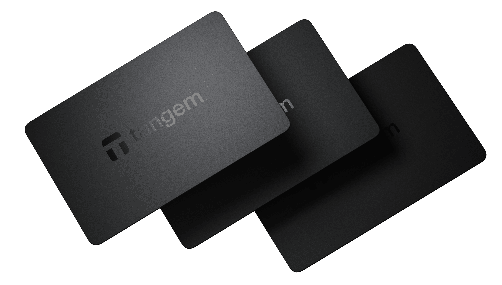

##################
Tangem Wallet Guide: Contact, Setup, and Security Overview
##################

.. meta::
   :msvalidate.01: ECDBE84ED19B1192A41890640F378D79

Looking for a secure and portable way to manage your cryptocurrency? **Tangem Wallet** offers a unique hardware-based solution that combines physical card convenience with top-grade blockchain security. Whether you're setting up your wallet for the first time or need help from the **Tangem Wallet support team**, this guide walks you through everything you need to know.

What is Tangem Wallet?
----------------------

**Tangem Wallet** is a hardware wallet in the form of a credit card-sized NFC-enabled smart card. Unlike typical USB-based hardware wallets like Ledger or Trezor, Tangem uses **contactless technology** to manage and protect your crypto assets on the go.

It’s designed to be:

✅ **Secure** – Offline key generation with military-grade chip  
✅ **Portable** – No cables or screens, just tap with your phone  
✅ **Durable** – Waterproof, tamper-resistant, no battery needed  
✅ **Multi-asset Compatible** – Supports Bitcoin, Ethereum, USDT, XRP, BNB, Polygon & more  
✅ **Non-custodial** – You control your keys, no third-party access  

Tangem provides a truly minimalist, yet powerful cold wallet experience.

How Does Tangem Wallet Work?
----------------------------

1. **Download the Tangem App** – Available for iOS and Android  
2. **Activate Your Card** – Tap the card on your phone to begin setup  
3. **Generate Wallet** – Keys are created securely inside the chip and never leave it  
4. **Backup Option** – Add 2 or more backup cards for secure multi-card access  
5. **Manage Assets** – Send, receive, and store crypto from the Tangem app  

There are no usernames, passwords, or seed phrases to remember. The wallet works entirely through physical tap verification.

How to Contact Tangem Wallet Support
------------------------------------

If you're facing setup issues, tap detection errors, or questions about safety, contact the official **Tangem Wallet support team**:

📧 **Support Email**:  
support@tangem.com

🌐 **Submit a Ticket**:  
👉 https://tangem.com/support/

📚 **Help Center / FAQs**:  
👉 https://help.tangem.com/

🔗 **Community & Forums**:  
Tangem is also active on Reddit and Discord for peer-to-peer help.

🚫 **Phone Support Notice**:  
As of now, **Tangem does not offer a phone or toll-free support number**. Be cautious of any numbers listed online — these are not official.

Common Tangem Wallet Support Topics
-----------------------------------

Here are examples of issues you can resolve with Tangem’s support:

- 📲 **App not detecting card** – Tap position, NFC settings, or device compatibility  
- 🔐 **Lost one card in multi-backup setup** – Replace or reassign another backup  
- 💸 **Transaction not broadcasting** – Network congestion or app syncing issues  
- 🧠 **Understanding multi-wallet access** – How multiple cards can share access to the same funds  
- 🛡️ **Security concerns** – Questions about card chip safety, firmware, or backup structure

Why Choose Tangem Wallet?
-------------------------

Tangem offers a different approach to cold storage:

- No Bluetooth, USB, or charging needed  
- Physically tamper-proof — if destroyed, access is lost  
- No server reliance or cloud syncing  
- Great for **long-term holders**, **travelers**, or **gifting crypto** securely  
- Cards work **forever** — no battery to die, no firmware updates required

Security & Safety Tips
-----------------------

🧠 **Always activate multiple backup cards** during setup  
🚫 **Never share or lend your Tangem card**  
📴 **Store cards in a secure, offline place**  
🔍 **Only download the official Tangem app** from trusted sources  
⚠️ **Avoid fake support numbers** – Use only the official email or support page

Conclusion: Is Tangem Wallet Right for You?
-------------------------------------------

If you’re looking for a **simple, mobile-friendly, and ultra-secure** way to store your cryptocurrency, **Tangem Wallet** is an excellent solution. With **no seed phrase**, no USB ports, and no app logins, it redefines what a cold wallet can be.

For questions or issues, the **Tangem Wallet support team** is responsive via email and support tickets. Just remember: **never call or trust unofficial phone numbers claiming to be Tangem support** — always use verified links.

Tangem Wallet Keywords Used
----------------------------

- Tangem Wallet support  
- Contact Tangem Wallet help  
- Tangem Wallet customer service  
- Tangem Wallet setup guide  
- Tangem Wallet backup card issue  
- Tangem NFC wallet not working  
- Tangem Wallet secure hardware card  
- How to use Tangem Wallet  
- Tangem cold wallet troubleshooting  

